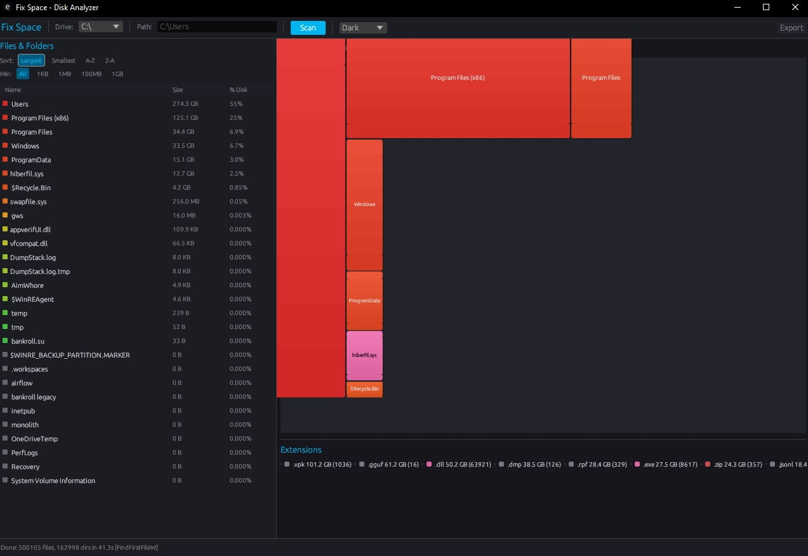

# Fix Space

**Analisador de uso de disco para Windows com visualização em treemap**

Inspirado no [WinDirStat](https://windirstat.net/) — reconstruído do zero em Rust para máxima performance.



## Features

- **Treemap interativo** — Algoritmo Squarified, cores de verde (pequeno) a vermelho (grande)
- **Tree View** — Arquivos/pastas ordenáveis com tamanho, % do disco e contagem de itens
- **Extension List** — Legenda colorida com contagem e tamanho total por extensão
- **Sincronização** — Clique no treemap seleciona no tree view e vice-versa
- **Context Menu** — Botão direito: Abrir no Explorer, copiar caminho, excluir
- **Excluir arquivos** — Remove arquivos/pastas com confirmação
- **Export HTML** — Relatório auto-contido com treemap e listagem de arquivos
- **5 Themes** — Dark, Midnight, Ocean, Forest, Light
- **Filtros e Ordenação** — Maior, menor, A-Z, Z-A. Filtro por tamanho mínimo (All, 1KB, 1MB, 100MB, 1GB)
- **Cores logarítmicas** — Distribuição equilibrada mesmo com grandes diferenças de tamanho

## Performance

| Cenário | Tempo |
|---------|-------|
| Scan de 100GB | ~15-30s |
| Rescan (cache) | <3s |
| Tamanho do binário | ~7MB |

Usa APIs nativas do Windows (`FindFirstFileW`/`FindNextFileW`) para enumeração rápida.

## Requisitos

- Windows 10/11
- Sem dependências externas (binário auto-contido)

## Instalação

### Build from source

```bash
# Requer Rust 1.75+
cargo build --release

# Binário em:
target/release/diskviz.exe
```

## Uso

1. Execute `diskviz.exe`
2. Selecione uma unidade no dropdown (ou digite um caminho personalizado)
3. Clique em **Scan**
4. Explore o treemap e o tree view
5. Clique nos itens para ver detalhes
6. Botão direito para menu contextual (abrir, copiar caminho, excluir)
7. Clique em **Export** para salvar um relatório HTML

## Architecture

```
src/
├── main.rs              # Entry point
├── app.rs               # Estado central da aplicação
├── scanner/
│   ├── mod.rs           # Scanner trait + factory
│   ├── types.rs         # ScanEntry, ScanResult
│   ├── mft.rs           # MFT scanner (planejado)
│   └── fallback.rs      # FindFirstFileW scanner
├── treemap/
│   ├── mod.rs           # Algoritmo Squarified
│   └── renderer.rs      # Cores e formatação
└── ui/
    ├── tree_view.rs     # Tree view ordenável
    ├── extension_list.rs # Lista de extensões
    ├── toolbar.rs       # Controles e themes
    └── themes.rs        # 5 themes
```

## Tech Stack

| Componente | Escolha |
|------------|---------|
| Linguagem | Rust |
| UI | egui (eframe) |
| Cache | rusqlite (SQLite) |
| File dialogs | rfd |
| Windows APIs | windows-rs |

## License

MIT
